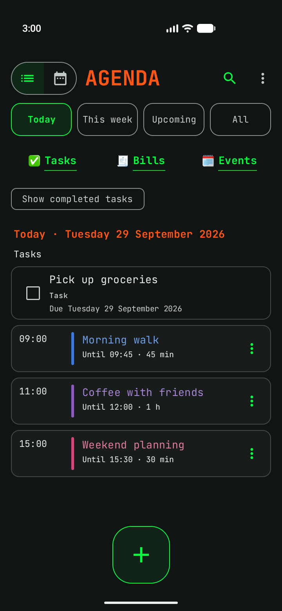
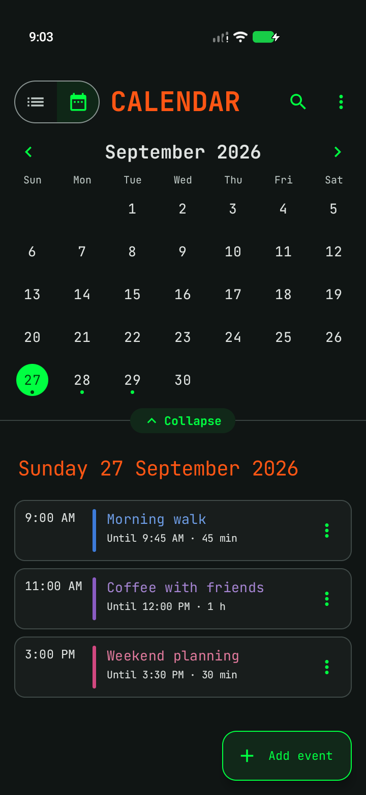
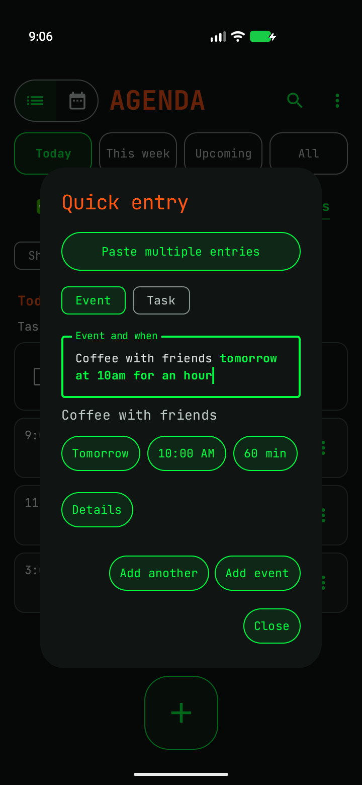
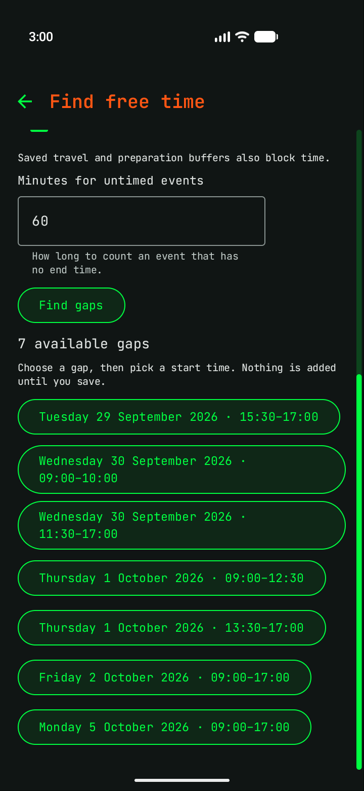

#  Planner

An offline-first Android planner built with Kotlin and Jetpack Compose.

## Support Planner

Enjoying Planner? Buy me a coffee to help support its development. Thank you!

<a href="https://ko-fi.com/baslawson"></a>

## Features

- Agenda and calendar views for events, tasks and bills.
- Offline natural-language Quick entry with editable previews.
- Turn a task into an event or an event into a task, and Undo/Redo while typing in the editors.
- Reminders (including ones that ring until stopped, and after a restart before the phone is unlocked), recurring entries, calendar file import (.ics, including repeating events) and free-time search.
- Calendars beside your own: Nextcloud, the calendars on your phone and calendar links, shown read-only; one Nextcloud calendar can be kept in sync both ways, automatically while Planner is open.
- Notes in Markdown with checklists, notebooks, tags, colours, attachments and reminders; optional two-way sync with the Nextcloud Notes app (and so with Quillpad).
- Document and bill scanning with cropping and on-device text recognition.
- Optionally send paid bills to [MyBudget](https://github.com/baslawson/mybudget), an envelope budgeting app, which asks for the category and records the expense. MyBudget also sees your upcoming unpaid bills, to plan for them.
- Matrix Green, High Contrast and Colour-blind friendly themes.
- Checks GitHub for new versions once a day (optional) and asks before downloading or installing.
- Report a bug from the ⋮ menu: it opens a prefilled GitHub issue and shows exactly what will be sent.

## Screenshots

Screenshots from the app using fictional demo entries. Shown in the Matrix Green theme.

| Agenda | Calendar |
| :---: | :---: |
|  |  |

| Quick entry | Find free time |
| :---: | :---: |
|  |  |

## Download

[Download the APK](https://github.com/baslawson/Planner/releases/latest), or install it with [Obtainium](https://github.com/ImranR98/Obtainium) to get updates automatically:

<a href="https://apps.obtainium.imranr.dev/redirect?r=obtainium://add/https://github.com/baslawson/Planner"></a>

Release tags match the app's version (tag `v0.0.24` is version 0.0.24), so Obtainium can tell when an update is available.

From 0.0.2 the app ID is `io.github.baslawson.planner` and releases are signed with a dedicated release key. Earlier builds (`com.example.itinerary`) are a separate app: export a backup from the old app, restore it in the new one, then uninstall the old one.

## Build and run

1. Clone this repository and open its root folder in Android Studio.
2. Install Android SDK platform 35 and let Gradle sync using the checked-in versions.
3. Use JDK 21 for Gradle. The daemon configuration requests JetBrains JDK 21 and can download it when needed.
4. Run the `app` configuration on an emulator or phone running Android 8.0 (API 26) or later.

From a terminal (use `gradlew.bat` on Windows):

```sh
./gradlew :app:assembleDebug :app:testDebugUnitTest
```

Set `ANDROID_HOME` to your Android SDK directory or let Android Studio create the ignored `local.properties` file. The first build requires internet access to download Gradle, the JDK and dependencies.

The debug APK is written to `app/build/outputs/apk/debug/app-debug.apk`. It installs as "Planner debug" (`io.github.baslawson.planner.debug`), next to the released app rather than over it. Debug signing keys are local to each developer; builds signed with different keys cannot update an existing installation in place.

`:app:assembleRelease` signs with the key named in a git-ignored `keystore.properties` in the project root (`storeFile`, `storePassword`, `keyAlias`, `keyPassword`). Without that file the release APK is left unsigned.

## Quick entry

- [Offline parsing guide](docs/QUICK_ENTRY_OFFLINE.md)

The offline parser needs no API key or backend server. Never commit personal API keys, signing keys or device backups.

## Tests

Local JVM tests live in `app/src/test`. Device tests live in `app/src/androidTest`; run them on a dedicated disposable emulator, since they exercise and modify app data:

```sh
./gradlew :app:connectedDebugAndroidTest
```

## Project layout

- `app/src/main`: application code and resources.
- `app/src/test`: parser, scheduling and other JVM tests.
- `app/src/androidTest`: device and UI tests.
- `docs`: feature guides.
- `baselineprofile`: makes the start-up profile (`app/src/main/baseline-prof.txt`), run by hand on an emulator.
- `tools`: local development helpers.
- `gradle`: pinned dependency versions and build wrapper.

Local QA captures, working notes, credentials, SDK paths, caches and APK binaries are excluded from Git. Keep personal working history and device backups separately.

## Licence

Planner's original code is licensed under **GPLv3**, with a narrow additional
permission for its existing Google ML Kit OCR dependency. See [LICENSE](LICENSE)
and [LICENSING.md](LICENSING.md) for the full terms. Bundled fonts and other
third-party components retain their own licences. The Google OCR component is
not open source.
